# Being-bad-for-a-day: exposing-the-ERMAC-malware-panel
Hello readers!

In today's article we bring you a demonstration of how the ERMAC banking malware works. Specifically, we will show, from the attacker's perspective, how this malware is used to extract sensitive information from infected devices. On the other hand, the decryption of the connection will also be addressed from the analyst's perspective.

ERMAC is a banking Trojan that was first spotted in 2021 and targets Android mobile devices. It is designed to steal sensitive information from infected devices such as credit cards, cryptocurrency wallets and login credentials to online stores. However, its functionalities are not limited to stealing passwords as it has other spying capabilities such as capturing keystrokes, access to SMS, contacts, installed applications, Google Authenticator codes, etcetera. 

Subsequently, the collected information is sent to a command and control (C2) server that the attacker uses for financial gain. It is distributed mainly through fake applications published in the Android Play Store.

We have managed to obtain the code of the command and control (C2) panel used by the attackers and it is composed of the following parts:

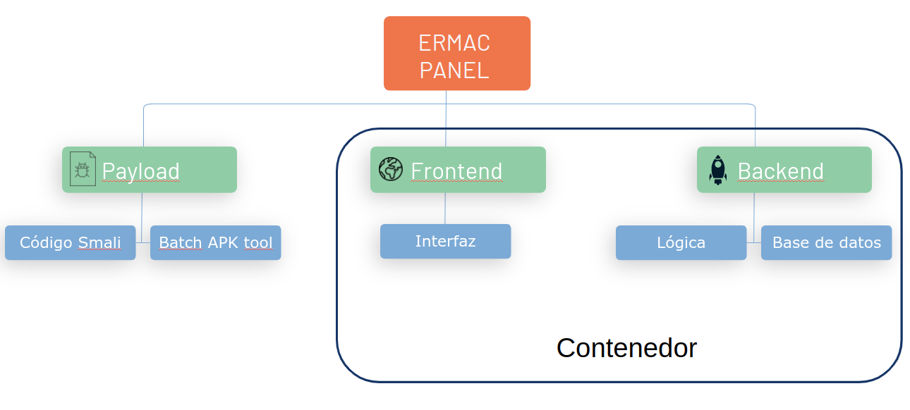

 Frontend: in charge of controlling the logic and functionality of the panel.
 Backend: in charge of controlling the logic and functionality of the panel.
 Payload: malicious code installed on mobile devices that communicates with the command and control (C2) server.
with the command and control (C2) server.

Both the frontend and the backend are designed to be mounted through a “docker” container.
a “docker” container. Once the panel is mounted, the graphical interface of the panel is as follows.
following:

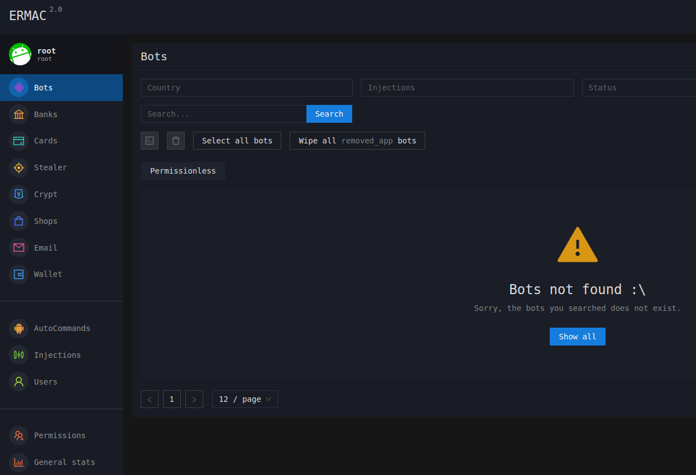

To see it in action, an Android system is created to infect it and add it to the botnet, so that it can be controlled from the panel. To do this, a virtual machine with the Android operating system and the SDK 29 installed is used along with an ERMAC sample located in VirusTotal identified with the hashes:

**MD5:** 87a8f2d833b1ff62e8ddc24dc88d901c 

**SHA-1:** 123ff97f09fb6d557614fcc0bd4ae0ce888b8c7f 

**SHA-256:** 6b465a1401f966b4e0cedf43aad1e7be916e3e83035e35e5de989fe32b976248

Subsequently, the Smali code inside the sample is modified in order to connect it to the panel that has been previously assembled. To decompile it, the APK Tool software is used with the following command:

`apktool d -r 6b465a1401f966b4e0cedf43aad1e7be916e3e83035e35e5de989fe32b976248.apk`

The APK has a .dex file, which contains Dalvik binary bytecode. This is the format that the Android platform actually understands. However, it is not easy to read or modify the binary code, so there are tools to convert to a human-readable representation, which is the Smali language.

Having the Smali code of the application, the file containing the command and control server where the malware is connected is searched, so it has to be modified. To do this, the following command is used:

Once it is known that this URL is in the file with path **“b0/b.smali”** it is modified:

Now that the sample has been modified, it is compiled again using the same application APK Tool. To do this, open a terminal in the folder containing the decompiled code and run the following commanddecompiled code and run the following command:

`apktool b .`

Finally, run the malicious application on the virtual machine and get a new connection to the malicious ERMAC panel on which you can perform a lot of commands:

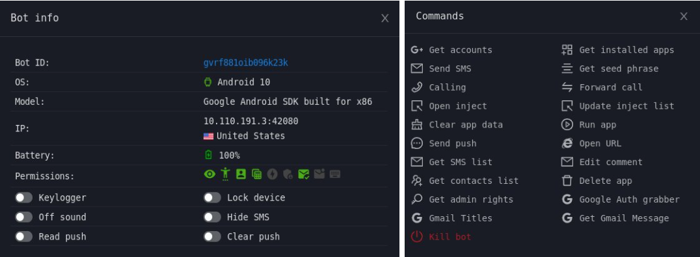

When attackers gain access to the mobile device, in order to obtain the user's banking credentials, they usually trigger the **“Open Inject”** command which is responsible for displaying on the infected system an HTML that looks exactly like the login page of the legitimate banking application. Below is an inject related to a Santander bank application:

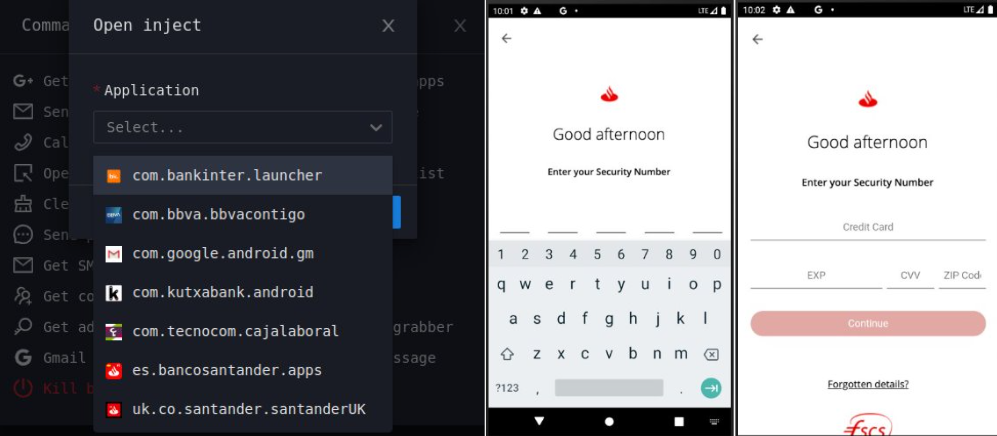

Once the data is entered, it is sent to the command and control server encrypted with the AES CBC algorithm and then encoded in Base64. and control server encrypted with the AES CBC algorithm and then encoded in Base64. 

Now, from the analyst's point of view, in order to decrypt the connection, we proceed to study the sample code. the sample code. The part in charge of decrypting the connection is found in the following function: “decrypt”. is in the following function:

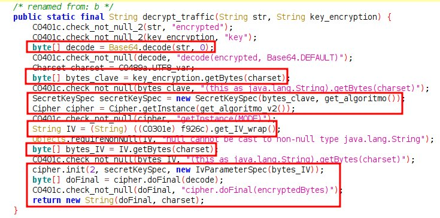

The above code performs the following steps:

1) Decodes the received Base64 which comes as the “str” parameter.

2) Gets the bytes of the key that is used to decrypt the connection, which is also passed through the “key_encryption” parameter.

3) Creates an instance of the SecretKeySpec class, initializing it with the key bytes obtained previously and the AES CBC algorithm.

4) Creates an instance of the Cipher class to perform decryption operations using the above mentioned algorithm.

5) It obtains the IV, or initialization vector, from the get_IV_wrap() function, which is subsequently used for decryption. Finally, it obtains the bytes of the same and stores them in the variable bytes_IV, which will be used later.

6) Performs the decryption operation using the AES CBC algorithm.

The parameters used to decrypt the connection are the following:

**KEY:** “1A1zP1eP5QGefi2DMPTfTL5SLmv7Divf”

**IV:** “012345676789abcdef”

By intercepting the requests made, you can see the commands sent and received between the panel and the infected Android system. We then proceed to display the commands exchanged when opening an inject as in the example shown above:

Decrypting the connection, it can be seen that the malware installed on the infected system sends the “checkAP” command to the server, which is used to ask if any action needs to be performed on the Android device.

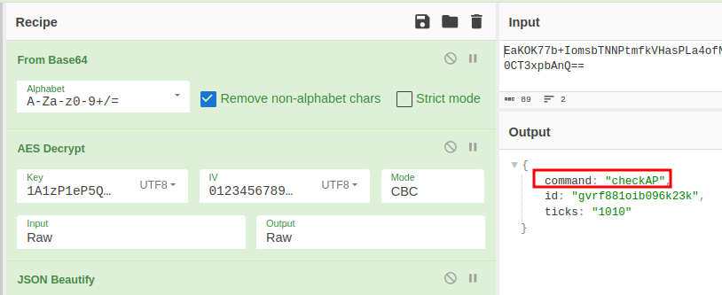

The response to this command by the C2 is the “startInject” command, which is used to open the HTML commented above. Specifically, it will open the inject corresponding to the application “uk.co.santander.santanderUK”, which is the Santander UK application.

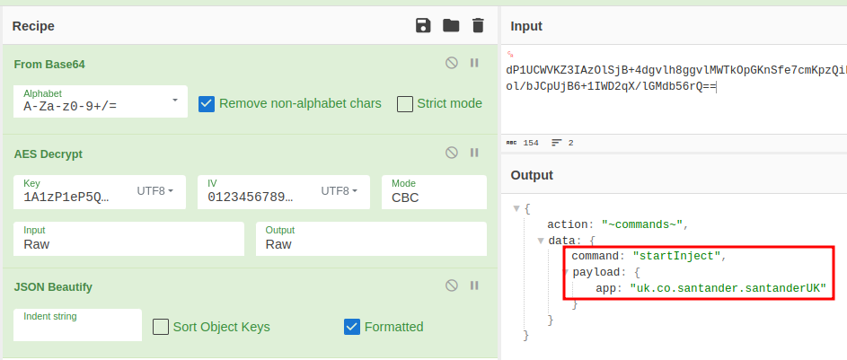

Once the HTML is launched, data is collected by the malicious application and sent back to the command and control server:

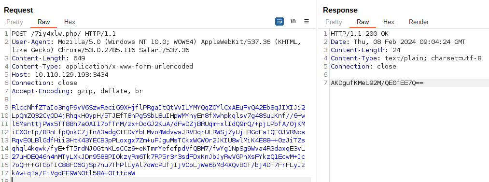

Deciphering this content gives “ok”:

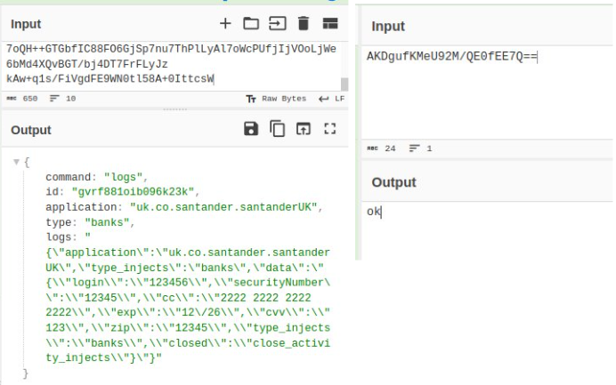

Finally, in the command and control server these credentials are obtained:

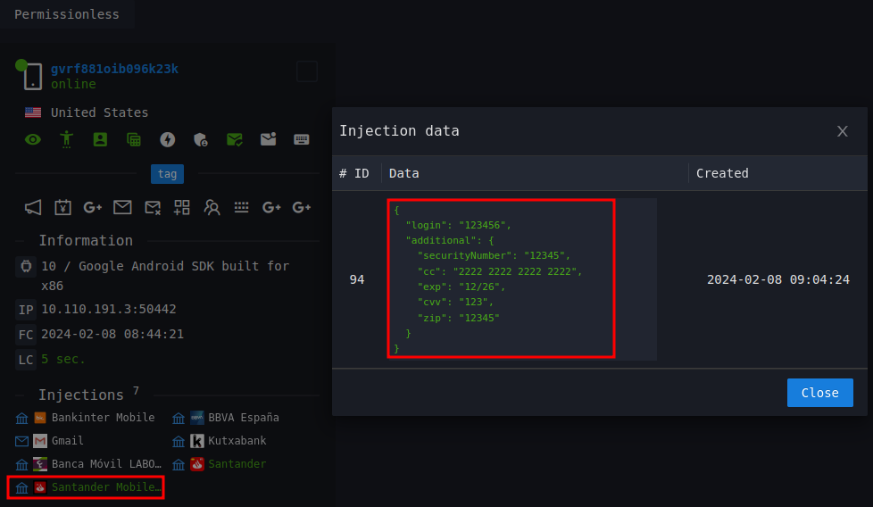

Below are some of the other functionalities of this malware:

 Device information: 

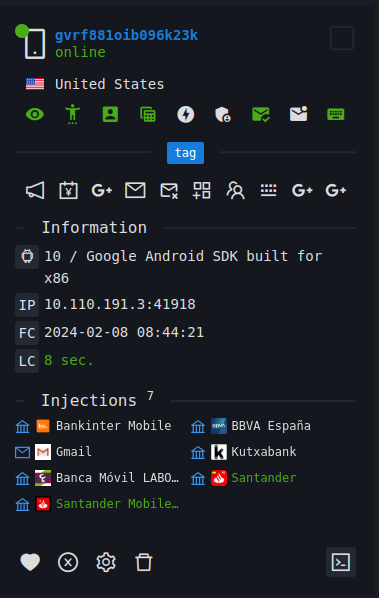

 Keylogger: 

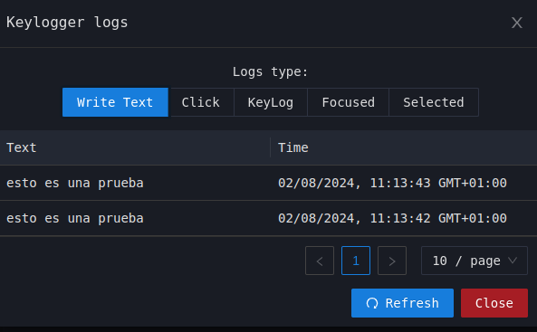

 SMS Reading: 

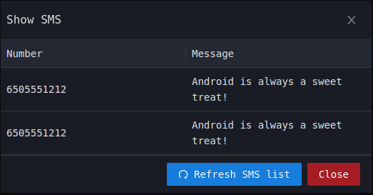

 Installed applications: 

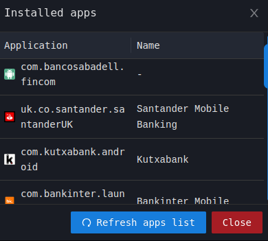

 Contact list: 

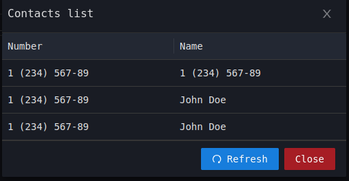

 Accounts on the phone: 

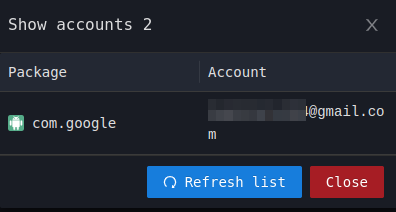

And this is the end of today's post. I hope you liked it, see you next time!

##References:

https://security-garage.com/es/investigaciones/siendo-malo-por-un-dia-exponiendo-el-panel-del-malware-ermac

https://www.threatfabric.com/blogs/ermac-another-cerberus-reborn

https://www.netapp.com/es/devops-solutions/what-are-containers/

